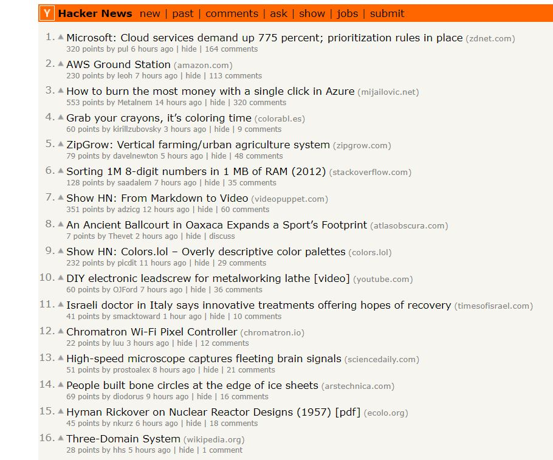

## Exploring Hackers News Posts

In this project, two different types of posts from Hacker News are compared. Hacker News is a popular site where technology related stories (or 'posts') are voted and commented upon. The two types of posts begin with either Ask HN or Show HN.

Users submit Ask HN posts to ask the Hacker News community a specific question, such as "What is the best online course you've ever taken?" Likewise, users submit Show HN posts to show the Hacker News community a project, product, or just generally something interesting.

These two types of posts is compared especially to determine the followings:

- Do Ask HN or Show HN receive more comments on average?
- Do posts created at a certain time receive more comments on average?
- It should be noted that the data set we're working with was reduced from almost 300,000 rows to approximately 20,000 rows by removing all submissions that did not receive any comments, and then randomly sampling from the remaining submissions.

